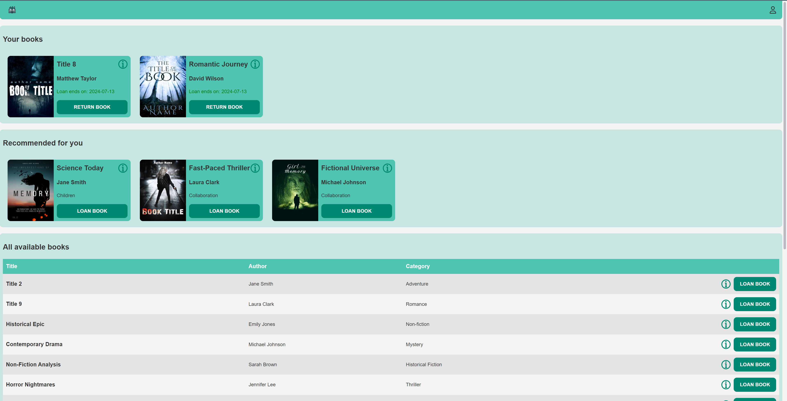
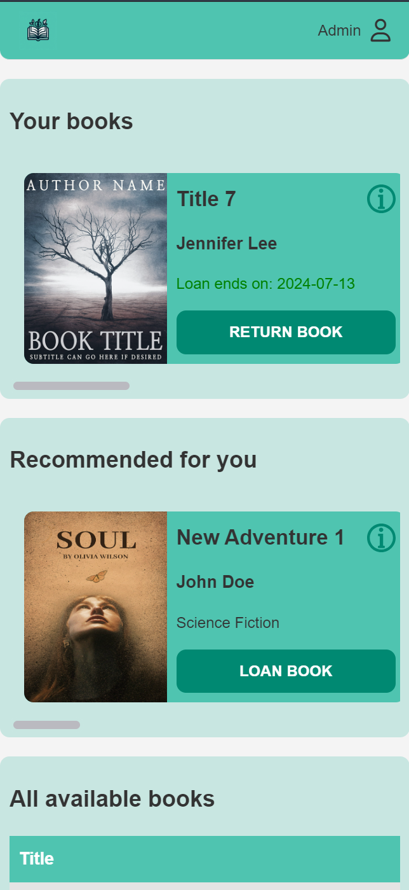
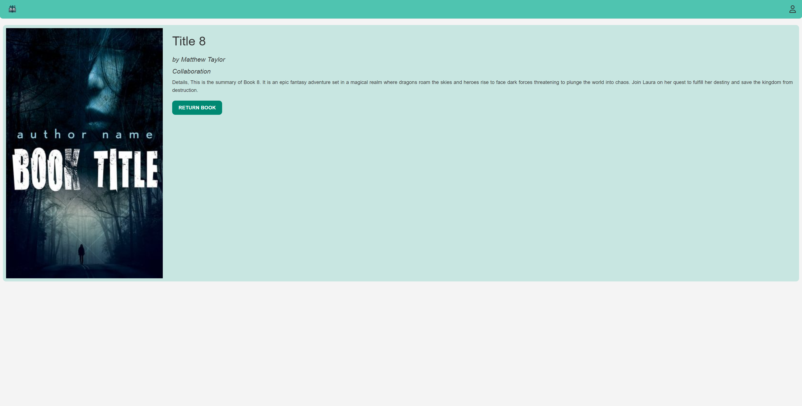
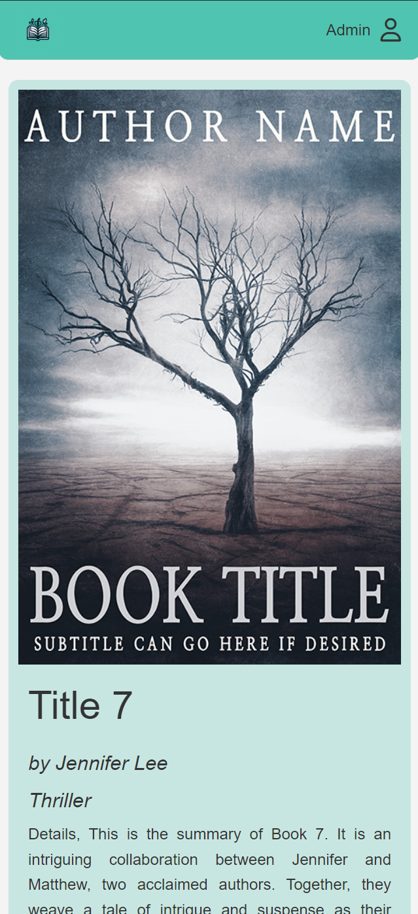
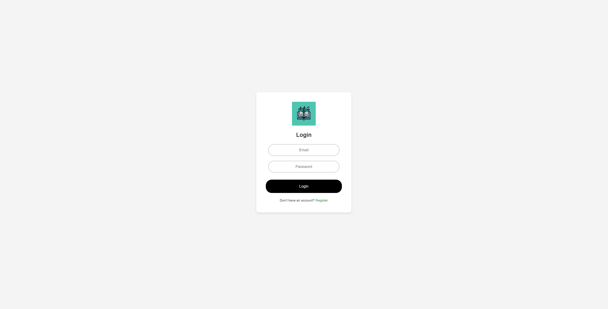
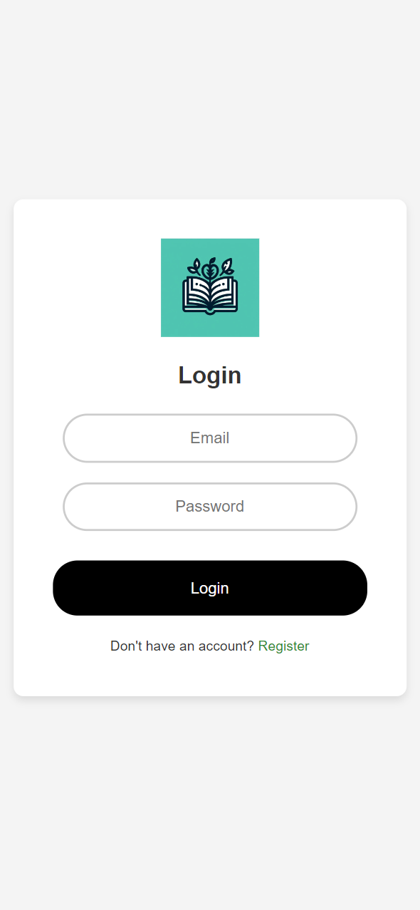
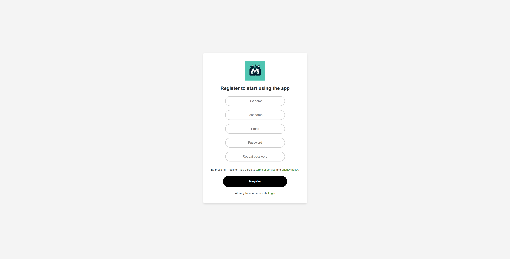
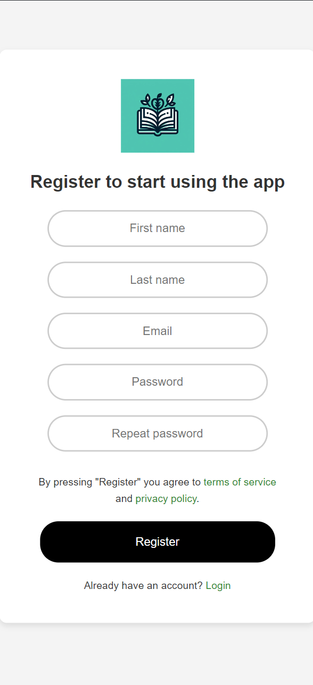

# Book Devour

Welcome to "Book Devour" - a simple and user-friendly library app designed to help you manage your personal book collection effortlessly. Whether you're a casual reader or a bibliophile, this app provides all the tools you need to organize, track, and explore your books.

# Table of Contents

1. [Features](#features)
2. [Technology Stack](#technology-stack)
3. [Database Design and Structure](#database-design-and-structure)
4. [Installation](#installation)
5. [Usage](#usage)

## Features

- **Browse Books:** Explore your book collection with ease.
- **Detailed Book Profiles:** Each book has a detailed profile including title, author, genre, and summary.
- **Loaning and returning books:** Easily loan and return loaned book in just one click.
- **User Accounts:** Create and manage your account to keep your book collection personalized.
- **Responsive Design:** Fully responsive design, making it easy to use on various devices.

## Technology Stack

This project leverages a variety of technologies to ensure efficiency, performance, and scalability. Here are the key components:

1. **Front-End:**
   - HTML, CSS, JavaScript: Used for structuring, styling, and implementing client-side logic.

2. **Back-End:**
   - PHP: The main server-side programming language.
   - PostgreSQL: A robust and scalable database management system.

3. **Server:**
   - Nginx: A high-performance web server.

4. **Containerization:**
   - Docker: Utilized for creating, deploying, and running applications in containers.
   - Docker Compose: Used for defining and managing multi-container Docker applications.

5. **Version Control:**
   - Git: For source code management.
   - GitHub: For hosting the repository, version control, and facilitating collaboration.

## Database Design and Structure

The project includes a comprehensive design and structure for the database, ensuring efficient data storage and retrieval. Here are the key components:

1. **Entity-Relationship Diagram (ERD):**
   - The `erd.png` file in the main directory provides a visual representation of the database schema. This diagram is useful for understanding the relationships between different entities in the database.
   - [View ERD](./erd.png)

2. **Database Schema:**
   - The `script.sql` file contains the SQL commands to create the database structure. It defines tables, relationships, and other database elements.
   - [View Database Script](./database.sql)

## Installation

The project is dockerized for easy setup and deployment. Follow these steps to get the project up and running:

1. **Clone the Repository**
2. **Navigate to the Project Directory**
3. **Docker Setup:**
   Ensure Docker and Docker Compose are installed on your system. In the project directory, you'll find Docker configuration files in the `docker/db`, `docker/nginx`, and `docker/php` directories, along with a `Dockerfile` in each.
4. **Build Docker Images:**
   `docker-compose build`
5. **Start Docker Containers:**
   `docker-compose up`
6. **Access the Application:**
   After the containers are up and running, you can access the application through your web browser.

## Usage

### Home Page
The home page showcases the loaned books, recommended books and the rest and provides links to key functionalities of the site such as browsing all books, logging in, and registering.
Desktop | Mobile
:-------------------------:|:-------------------------:
  |  

### Book View
This detailed view allows users to see full information about the book, including photos, descriptions, author, and genre.
Desktop | Mobile
:-------------------------:|:-------------------------:
 | 

### Login View
These pages allow users to login to the system, which is necessary for loaning books and using features that require authorization.
Desktop | Mobile
:-------------------------:|:-------------------------:
 | 

### Registration View
These pages allow users to create new account in the system, which is necessary for loaning books and using features that require authorization.
Desktop | Mobile
:-------------------------:|:-------------------------:
 | 

